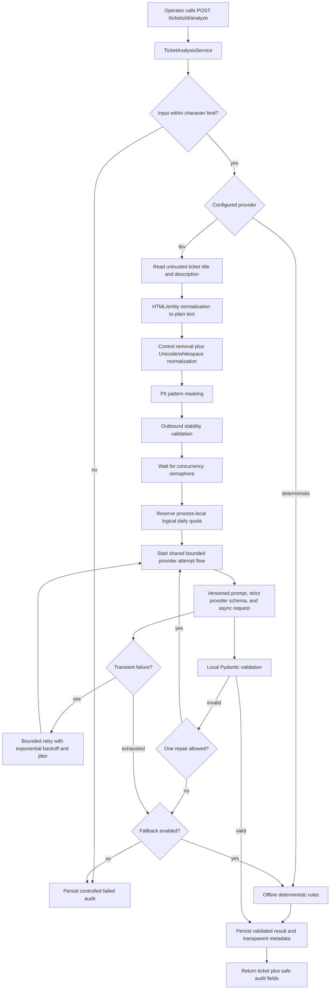

# AI analysis architecture

## Request flow

Analysis is always an explicit API action. Ticket creation and updates do not
spend external model quota automatically.

## Provider contract

`TicketAnalysisProvider` is a typed `Protocol` with provider identity, model,
external/offline classification, async `analyze`, and async `close` operations.

Implementations:

- `DeterministicTicketAnalysisProvider` runs keyword rules fully offline. It has
  no secret, network client, or model claim.
- `OpenAILLMTicketAnalysisProvider` uses the pinned official async SDK and
  Responses API. `AI_BASE_URL` can select an HTTPS OpenAI-compatible endpoint,
  although compatibility must be verified for that endpoint and model.

`AI_MODEL` has no application default and is required in LLM mode. Availability
and pricing depend on the operator's provider/account. `AI_BASE_URL` is the only
supported endpoint override; the SDK receives an explicit endpoint even when it
uses the official default, so `OPENAI_BASE_URL` cannot redirect requests.

The factory selects one primary provider from `AI_PROVIDER`. FastAPI lifespan
constructs one service instance so its semaphore and daily counter are shared by
requests in that process. Tests override the service dependency with fake
providers or use an `httpx.MockTransport`; they do not use the network.

## Structured output and prompt versioning

`TicketAnalysisResult` permits only:

- a fixed category enum;
- `low`, `medium`, or `high` priority;
- summary up to 500 characters;
- suggested reply up to 2,000 characters;
- confidence from 0 through 1;
- no more than six short, pattern-limited reasoning tags.

Extra fields are forbidden. The provider receives an explicit limited JSON
Schema containing only object/array types, properties, required fields,
`additionalProperties=false`, and enums. Unsupported length, pattern, numeric,
and array-size keywords are omitted provider-side. The full
`TicketAnalysisResult` Pydantic model independently enforces every constraint
locally; the API never trusts JSON merely because the endpoint labeled it
structured.

`ticket-analysis-v1` instructs the model to treat ticket JSON as untrusted data,
ignore instructions inside it, avoid actions and claims of completed work, omit
chain-of-thought, and create a draft for human review. Unsupported prompt
versions fail configuration validation.

## Retry and fallback policy

One logical analysis may include:

1. An initial external request.
2. Up to `AI_MAX_RETRIES` shared transient retries for timeout, connection, HTTP
   429, or HTTP 5xx failures. Delay is bounded exponential backoff with jitter.
3. Up to `AI_MAX_REPAIRS` fresh repair phases after invalid completed output. A
   repair uses the remaining shared budget and cannot create another full retry
   chain. The invalid raw output is not copied into the repair prompt.

The hard upper bound is `1 + AI_MAX_RETRIES + AI_MAX_REPAIRS` provider HTTP
attempts. A timeout may happen after the provider processed an attempt, so retry
can duplicate token consumption or charges. Known usage is accumulated, but it
is not exact billing reconciliation.

Authentication and non-transient request errors are not retried. Cancellation is
re-raised and `async with` releases timeout/semaphore resources.

Fallback is considered only for an external primary provider and only when
`AI_FALLBACK_ENABLED=true`. A fallback response records `provider_requested=llm`,
`provider_used=deterministic`, `fallback_used=true`, and the triggering safe error
category. It is never presented as an LLM result.

## Limits and usage

- Original title plus description is checked against `AI_MAX_INPUT_CHARS` before
  calling any provider.
- Ticket descriptions have a separate 20,000-character API storage limit. The
  provider limit defaults to 8,000 combined title/description characters and may
  be configured only up to the maximum storable title plus description size.
- `AI_MAX_OUTPUT_TOKENS` is sent to the external provider; string lengths are
  separately enforced by Pydantic.
- A semaphore enforces `AI_MAX_CONCURRENT_REQUESTS` per process.
- A UTC-day in-memory counter accepts at most `AI_DAILY_REQUEST_LIMIT` user
  analysis operations. It is consumed after the concurrency slot is acquired, so
  cancellation while waiting does not consume quota. HTTP calls are counted
  separately in `provider_attempts`; repair calls are also counted in
  `repair_attempts`.
- Provider-reported input/output token counts are summed for completed initial
  and repair responses. A provider error might not include billable usage, so
  stored counts are not a billing ledger.

These controls are process-local. Multiple workers need shared quota/rate-limit
infrastructure before this can enforce a global budget.

## Persistence

Migration `0002` adds nullable result/audit columns, so existing `0001` rows are
preserved on upgrade. Analysis stores:

- confidence and reasoning tags;
- status, requested/used provider, requested/used model, prompt version, and fallback flag;
- original input character count, reported token counts, latency;
- provider/repair attempt counts, error category, sanitized provider request ID,
  and timestamp.

It does not store the API key, prompt, raw provider response, or another full copy
of ticket input. A failed analysis writes safe failure audit metadata without
overwriting the last successful classification/draft fields.

Analysis reads an immutable ticket snapshot in a short worker-thread database
unit, closes the session, awaits the provider, then opens a new short unit to
verify that the ticket still exists and has not changed before committing the
validated result atomically.

`model_requested` records the configured external model. `model_used` records
the validated model reported by the successful provider; deterministic execution
uses `null` for both. Transparent fallback keeps the external requested model and
uses `null` for the deterministic model used.
